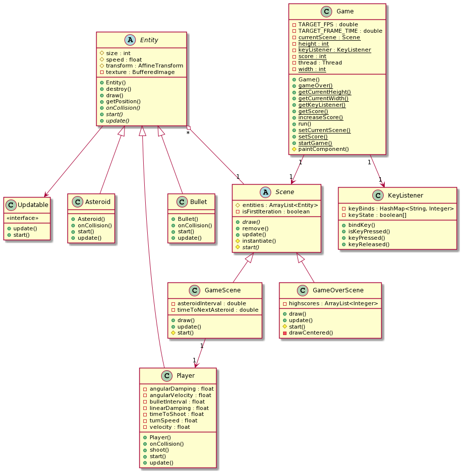

# Clone do jogo Asteróides

**Técnicas de Programação 1**

- Brenno Pereira Cordeiro - 190127465
- Joao Vitor Maia Ferreira - 190110007

## 1. Descrição de Problema

Neste projeto, desenvolvemos um clone do jogo Asteroids usando a linguagem de
programação Java e os conceitos de programação orientada a objetos.

Asteroids é um jogo do tipo arcade, lançado em Novembro de 1979 pela Atari, Inc.
O jogador controla uma nave espacial num campo de asteróides, e deve atirar e
destruir os asteróides enquanto evita colidir com os mesmos.


Nosso objetivo é implementar um jogo similar, com uma nave espacial se movendo
livremente pelo tela do jogo, e asteróides errantes que ameaçam colidir com o
jogador. No entanto, nosso objetivo é bem mais simples, pensando apenas em
implementar o fluxo básico do jogo, para desenvolver a prática dos conceitos de
orientação à objeto.

## 2. Regras de Negócio

1. O _jogador_ pode se mover livremente pela tela do jogo, usando as teclas `a`
   e `d` para rotacionar a nava, e a tecla `w` para adicionar propulsão.
2. Ao sair da tela do jogo, o **fim do jogo** deve ocorrer.
3. Durante o jogo, _asteróides_ aparecem em posições aleatórias.
4. Um _asteróide_ deverá ser destruído ao sair da região da tela.
5. O _jogador_ é capaz de atirar um número ilimitado de _balas_ com uma certa
   cadência.
6. Uma _bala_ tem uma direção inicial, e se move nessa direção com velocidade
   constante.
7. Uma _bala_ deverá ser destruída ao sair da região da tela.
8. Um _asteróide_ é destruído ao colidir com uma _bala_.
9. Uma _bala_ é destruída ao colidir com um _asteróide_.
10. A _pontuação_ é incrementada quando um _asteróide_ colide com uma _bala_.
11. O **fim do jogo** ocorre quando um _asteróide_ colide com o _jogador_.
12. O usuário pode inserir o seu nome no **fim do jogo** para salvar sua
    pontuação.

## 3. Diagram de Classes

### Game

A classe Game é responsável por selecionar a _cena_ atual e criar o _loop de
jogo_. O loop de jogo é um loop infinito, que guarda o tempo que levou para
completar. Isso é importante para que nossa simulação de física precisa levar em
conta o tempo nos cálculos.

Cada iteração do loop de jogo vamos chamar de _frame_, e o tempo levado por um
_frame_ vamos chamar de _delta time_ ou `dt`. A cada frame a classe Game chama o
método `update` da cena atual, informando o delta time para o método. A
implementação do loop de jogo é baseada no artigo [Fix Your Timestep!][timestep].

### Scene

A classe Scene, ou cena, representa uma composição de _entidades_. Essa classe é
responsável por instanciar as entidades, atualizá-las, desenhá-las na tela e
destruí-las.

Cada cena do jogo herda dessa classe, e implementa sua própria lógica para
interagir com o ciclo de vida.

### Entity

```java
    protected final int size;
    protected float speed;
    protected Transform transform;
    protected final Scene scene;
    private BufferedImage texture;
```

A classe abstrata Entity, ou _entidade_, é uma abstração de todos os elementos
que serão desenhados na tela. Uma entidade possui tamanho, velocidade, um
[Transform](#transform), a cena que o criou e uma textura.

A cada frame, a textura da entidade é desenhada na tela, na posição e rotação
definidas pelo seu Transform.

A entidade implementa os métodos `destroy`, para sinalizar a sua cena que deve
ser destruída, e os métodos abstratos `update`, chamada a cada frame com o delta
time, e `onCollision`, chamado quando ocorre uma colisão envolvendo aquela
entidade.

### Asteroid

Asteroid herda da classe Entity. No seu método `update`, se move em uma direção
com velocidade constante e verifica se sua posição saiu da região da tela.

### Bullet

Bullet herda da classe Entity. Em seu método `onCollision` chama seu método
`destroy()` caso tenha uma colisão com uma _Entity_ do tipo _Asteroid_,
isso foi feito para que um _Bullet_ não anule um outro do mesmo tipo.

### Player

Player herda da classe Entity. Em seu método `onCollision` chama o método
`Game.gameOver()` caso o objeto colidido seja do tipo _Asteroid_.

Possui também o método `shoot()`, responsável por instanciar um novo objeto do
tipo _Bullet_ na _Scene_.

### Scene

Scene é uma classe abstrata. Seu método principal, o `update(double dt)`, é
responsável por fazer as atualizações na tela de acordo com as ações do jogo e
com o tempo _dt_ passado, nesse método chama o update de toda sua lista de
entidades, checa por colisões, e ao fim adiciona/remove entidades que colidiram
ou foram criadas.

### Game
```java
   private static final KeyListener keyListener = new KeyListener();
   private static int score;
   private static Scene currentScene;
```
Game herda da classe JPanel, é responsável por inicializar os principais componentes
como tela, _timer_ e _KeyListener_. Também cria a instância da classe GameScene.

### GameScene
GameScene herda da classe Scene. Em seu método `start()` realiza o binding dos
códigos de cada tecla para uma string, facilitando a leitura do código em outras
classes, também é responsável por controlar o tempo em que novos `Asteroids` são
criados já que também é responsável pela criação dos mesmos.

### GameOverScene

Essa classe representa a tela de **fim de jogo**. Ela é responsável por mostrar
a mensagem de **fim de jogo** ao usuário, assim como ler e escrever no arquivo
de pontuações, com as 5 maiores ponturações.

### KeyListener

Essa classe guarda o estado dos 256 códigos do teclado. Durante o `update` das
entidades, é possível obter o estado de uma determinada tecla para executar uma
determinada ação. Também é possível associar um nome a um código, para manter o
código mais legível.

[timestep]: https://www.gafferongames.com/post/fix_your_timestep/


# Diagrama
